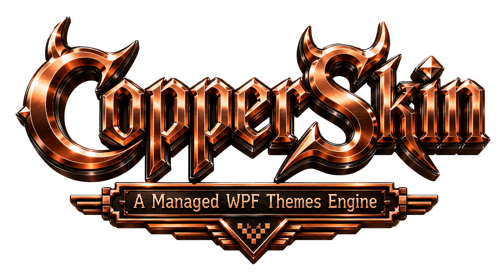
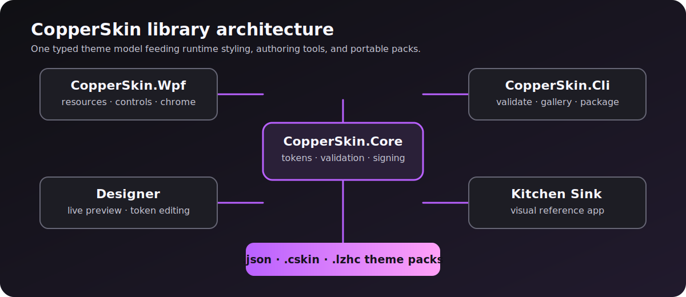
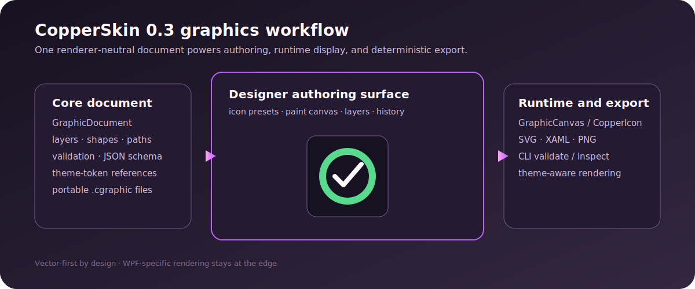
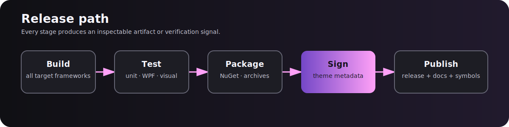

# CopperSkin



CopperSkin is a reusable WPF theme platform for applications that need runtime theme switching, consistent standard-control styling, custom window chrome, scoped themes, theme authoring tools, and portable theme packs.

[](https://dotnet.microsoft.com/)
[](https://opensource.org/license/mit/)



Version `0.3.0.0` adds a vector-first icon and basic-paint editor, shared runtime graphics surfaces, deterministic export, and a broader documented WPF control surface.

## What is included

| Project | Purpose | Target frameworks |
| --- | --- | --- |
| `CopperSkin.Core` | Typed theme model, validation, JSON, archives, signing, and audits | `netstandard2.0`, `net7.0`, `net8.0`, `net9.0`, `net10.0` |
| `CopperSkin.Wpf` | Runtime resources, implicit styles, scoped themes, chrome, and dialogs | `net7.0-windows`, `net8.0-windows`, `net9.0-windows`, `net10.0-windows` |
| `CopperSkin.Cli` | Theme export, validation, galleries, baselines, diffs, signing, and packaging | `net8.0`, `net9.0`, `net10.0` |
| `CopperSkin.Designer` | Live theme preview, token editing, graphics authoring, diagnostics, and export | `net8.0-windows`, `net9.0-windows`, `net10.0-windows` |
| `CopperSkin.SampleKitchenSink` | Runnable visual reference application | `net8.0-windows`, `net9.0-windows`, `net10.0-windows` |

## Quick start

Install the `CopperSkin.Core` and `CopperSkin.Wpf` `0.3.0` NuGet packages (assembly version `0.3.0.0`), then install the runtime during application startup:

```csharp
using CopperSkin.Core.Theming;
using CopperSkin.Wpf;

CopperSkinApp.Use(Application.Current)
    .Pack(BuiltInThemeCatalog.Create())
    .Theme("Neon Studio")
    .Backdrop(CopperSkinBackdropKind.Mica)
    .Install();
```

For Visual Studio designer support, merge the XAML resources as well:

```xml
<Application.Resources>
  <ResourceDictionary>
    <ResourceDictionary.MergedDictionaries>
      <copper:CopperSkinThemeResources Theme="FL Grape" />
    </ResourceDictionary.MergedDictionaries>
  </ResourceDictionary>
</Application.Resources>
```

Declare `xmlns:copper="clr-namespace:CopperSkin.Wpf;assembly=CopperSkin.Wpf"`. Runtime installation can still switch the active theme after startup.

## Themed shell and dialogs

Use `CopperWindow` when CopperSkin should own the application chrome:

```xml
<controls:CopperWindow
    x:Class="MyApp.MainWindow"
    xmlns:controls="clr-namespace:CopperSkin.Wpf.Controls;assembly=CopperSkin.Wpf"
    Title="My Copper App"
    Width="1100"
    Height="720">
  <Grid />
</controls:CopperWindow>
```

Scope a different theme to a subtree:

```xml
<Border
    xmlns:cs="clr-namespace:CopperSkin.Wpf;assembly=CopperSkin.Wpf"
    cs:CopperSkinThemeScope.Theme="Copper Desk">
  <StackPanel />
</Border>
```

Show a themed message or task dialog from code:

```csharp
CopperMessageBox.Show(this, "Saved", "Theme pack exported.", "Nice");

new CopperTaskDialog
{
    Title = "Validation",
    Heading = "All good",
    Text = "No blocking theme errors.",
    Icon = CopperTaskDialogIcon.Information
}.Show(this);
```

## Graphics editor and runtime icons

The Designer's **Graphics** tab creates icon or paint documents with layers, visibility/lock controls, rectangle/ellipse/line/freehand tools, zoom, undo/redo, save/open, and SVG/XAML/PNG export.



The file format is renderer-neutral and can be validated in a build pipeline:

```csharp
using CopperSkin.Core.Graphics;

var icon = new GraphicDocument
{
    Id = "status.ok",
    Name = "Status OK",
    DocumentType = GraphicDocumentType.Icon,
    Width = 24,
    Height = 24,
    Layers =
    [
        new GraphicLayer
        {
            Id = "mark",
            Name = "Mark",
            Elements =
            [
                new GraphicElement
                {
                    Id = "circle",
                    Kind = GraphicElementKind.Ellipse,
                    Geometry = new GraphicGeometry { Bounds = new GraphicRect(2, 2, 20, 20) },
                    Style = new GraphicStyle { FillToken = "color.status.success" }
                }
            ]
        }
    ]
};

var json = GraphicDocumentSerializer.Serialize(icon);
var diagnostics = GraphicDocumentValidator.Validate(icon);
```

Render the same document in an application without duplicating the editor:

```xml
<copper:CopperIcon Document="{Binding StatusIcon}"
                   AccessibleName="Success"
                   Width="24"
                   Height="24" />
```

Declare `xmlns:copper="clr-namespace:CopperSkin.Wpf.Controls;assembly=CopperSkin.Wpf"` for the runtime control.

For headless validation and canonical JSON export:

```powershell
$cli = ".\src\CopperSkin.Cli\CopperSkin.Cli.csproj"
dotnet run --project $cli -c Release -f net10.0 -- graphics validate .\status.ok.cgraphic
dotnet run --project $cli -c Release -f net10.0 -- graphics inspect .\status.ok.cgraphic
dotnet run --project $cli -c Release -f net10.0 -- graphics export .\status.ok.cgraphic .\artifacts\status.ok.json
```

WPF SVG, XAML, and PNG export is available through `GraphicExportService`; Core-only CLI export intentionally remains renderer-free.

## Tools

Run the Designer:

```powershell
dotnet run --project .\src\CopperSkin.Designer\CopperSkin.Designer.csproj -c Release -f net10.0-windows
```

Run the CLI:

```powershell
$cli = ".\src\CopperSkin.Cli\CopperSkin.Cli.csproj"
dotnet run --project $cli -c Release -f net10.0 -- list
dotnet run --project $cli -c Release -f net10.0 -- export-builtins .\artifacts\theme-pack.json
dotnet run --project $cli -c Release -f net10.0 -- validate .\artifacts\theme-pack.json
dotnet run --project $cli -c Release -f net10.0 -- gallery .\artifacts\theme-pack.json .\artifacts\gallery
dotnet run --project $cli -c Release -f net10.0 -- baseline .\artifacts\theme-pack.json .\artifacts\visual-baseline.json
```

Create and verify a signed theme pack. Keep the private key outside source control:

```powershell
dotnet run --project $cli -c Release -f net10.0 -- keygen .\artifacts\signing.private .\artifacts\signing.public
dotnet run --project $cli -c Release -f net10.0 -- sign .\artifacts\theme-pack.json .\artifacts\signed-theme-pack.json .\artifacts\signing.private
dotnet run --project $cli -c Release -f net10.0 -- verify-signature .\artifacts\signed-theme-pack.json .\artifacts\signing.public
```

## Build and test

```powershell
dotnet restore .\CopperSkin.slnx
dotnet build .\CopperSkin.slnx -c Release
dotnet test .\CopperSkin.slnx -c Release --no-build
```

The verification matrix covers Core, CLI, WPF, and visual smoke tests on the supported .NET 8/9/10 lanes. WPF tests run on Windows.



## Documentation

- [Getting started](docs/GETTING_STARTED.md)
- [Graphics format](docs/GRAPHICS_FORMAT.md)
- [Accessibility and control behavior](docs/ACCESSIBILITY.md)
- [Theme format](docs/THEME_FORMAT.md)
- [Control coverage](docs/CONTROL_COVERAGE.md)
- [Release checklist](docs/RELEASE_CHECKLIST.md)
- [Deployment plan](docs/aegis/plans/2026-07-16-library-deployment.md)
- [Release notes](RELEASE_NOTES.md)
- [Changelog](CHANGELOG.md)

## Project status

`0.3.0.0` is the first public-release line. The branch is verified by the Windows CI workflow with warnings treated as errors, the full multi-target test matrix, and Core/WPF package validation. Publishing to NuGet is tag- and secret-gated; see the [release checklist](docs/RELEASE_CHECKLIST.md).

## License

CopperSkin is released under the [MIT License](LICENSE).
